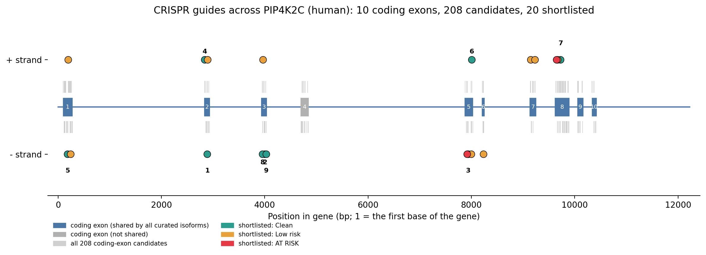
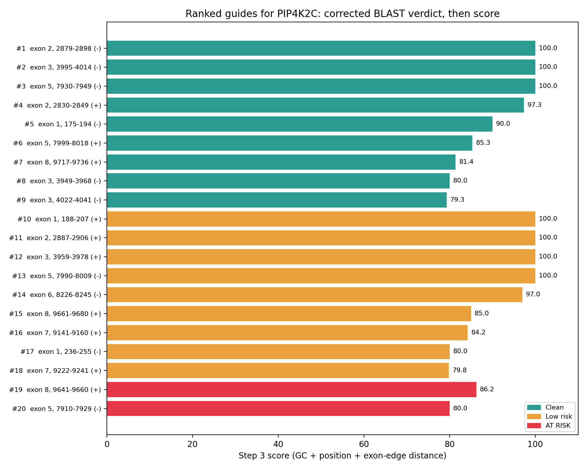

# CRISPR-GuideDesigner

A Python/Biopython pipeline that designs and ranks SpCas9 guide RNAs for a target gene, screens them for off-target sites, and validates the top picks against a published tool (CRISPOR).

**Case studies:**
1. *lacZ* in *E. coli* K-12 MG1655 (`NC_000913.3`) — proves the core pipeline with an exhaustive, genome-wide off-target search
2. **PIP4K2C** (human, chr12) — extends the pipeline to a eukaryotic gene with exons/introns, adds exon-aware filtering, a genomic BLAST off-target screen, and validation against CRISPOR

> Developed on an Android tablet using Pydroid 3 and Google Colab.

## Why this project

Choosing a CRISPR guide is a genetics problem (where can Cas9 cut, and where might it cut by mistake?) that has to be solved computationally, because a single gene has hundreds of candidate sites and a genome has millions. This project encodes the biological rules of Cas9 targeting into code, step by step, and checks its own conclusions against real gene structure and an independent published tool rather than assuming its heuristics are correct.

---

## Case study 1: *E. coli lacZ*

### Pipeline

| Step | Script | What it does | Output |
|---|---|---|---|
| 1 | `src/fetch.py` | Downloads the *E. coli* genome from NCBI and extracts *lacZ* | `ecoli_genome.gb`, `lacZ.fasta` |
| 2 | `src/pam_finder.py` | Finds every NGG PAM on both strands and extracts the 20-nt guide in front of each | `guides_all.csv` |
| 3 | `src/scoring.py` | Filters (GC 40-60%, no TTTT/GGGG), scores, and shortlists 20 spaced-out guides | `guides_scored.csv`, `guides_shortlist.csv` |
| 4 | `src/offtarget.py` | Compares each guide with every NGG site in the genome (up to 4 mismatches, seed region weighted double) | `guides_final.csv`, `offtarget_hits.csv` |
| 5 | `src/plot_results.py` | Plots the guide map and ranking, and writes a summary | `guide_map.png`, `guide_ranking.png`, `summary.md` |

### Results (*lacZ*, 3,075 bp)

- **415** candidate guides (NGG PAM, both strands) -> **242** pass GC/motif filters -> **20** shortlisted
- **11 of 20** shortlisted guides have no off-target site up to 4 mismatches, checked against the **entire** *E. coli* genome


| Rank | Guide (5'-3') | PAM | Strand | Position | Score | Off-targets (0/1/2/3/4mm) |
|---|---|---|---|---|---|---|
| 1 | `CGTAATGGGATAGGTCACGT` | TGG | - | 308-327 | 100.0 | 0/0/0/0/0 |
| 2 | `TATGCAGCAACGAGACGTCA` | CGG | - | 633-652 | 100.0 | 0/0/0/0/0 |
| 3 | `GCAAATAATATCGGTGGCCG` | TGG | - | 1484-1503 | 100.0 | 0/0/0/0/0 |

Positions are inside the gene (1 = the A of the ATG start codon). Full table in `results/summary.md`.

---

## Case study 2: human PIP4K2C

PIP4K2C is a poorly-characterized lipid kinase -- chosen deliberately as an understudied gene, in contrast to a heavily-studied one like TP53. Unlike *lacZ*, it has introns, so a candidate guide's position relative to exon structure now matters.

### Pipeline

| Step | Script | What it does | Output |
|---|---|---|---|
| 1 | `src/phase2/phase2_fetch.py` | Downloads the PIP4K2C region from NCBI and builds a coding-exon table across all isoforms | `pip4k2c_gene.fasta`, `pip4k2c_exons.csv` |
| 2 | `src/phase2/exon_guides.py` | Finds every guide across the whole gene, keeps guides whose cut lands in a coding exon | `pip4k2c_guides_all.csv`, `pip4k2c_guides_coding.csv` |
| 3 | `src/phase2/exon_scoring.py` | Filters (GC, motifs, exon shared by all curated isoforms, not an NMD-escape zone, >=5 bp from a splice edge), scores, shortlists 20 | `pip4k2c_guides_scored.csv`, `pip4k2c_shortlist.csv` |
| 4 | `src/phase2/blast_offtargets_v_2.py` | Screens each guide with **genomic-only** NCBI BLAST (transcript/mRNA records excluded), collapses duplicate records into unique loci | `pip4k2c_blast_hits_genomic.csv`, `pip4k2c_unique_loci.csv` |
| 4b | `src/phase2/fix_self_hits.py` | Re-checks every hit's actual sequence against the gene itself, to catch self-matches under an unrelated accession that coordinate/text matching missed | `pip4k2c_offtarget_verdict_fixed.csv` |
| 5 | `src/phase2/exon_plot_results_colab.py` | Plots the exon/intron map and ranking, colored by verdict, and writes a summary | `pip4k2c_gene_map.png`, `pip4k2c_ranking.png`, `pip4k2c_summary.md` |

### Results (PIP4K2C, 12,227 bp, 1,266 nt CDS across 10 coding exons)

- **1,732** candidate guides across the whole gene -> **208** cut a coding exon -> **93** pass the exon-aware filters -> **20** shortlisted
- Off-target verdict after correction: **9 Clean, 9 Low risk, 2 AT RISK** (of 20)
  - AT RISK guides hit **PIP5K1C** (a related kinase) and **KCNQ1** (an unrelated cardiac ion-channel gene) with an adjacent PAM present
  - Exon 4 excluded (not shared by all curated isoforms); exons 9-10 largely excluded (nonsense-mediated-decay escape risk)





| Rank | Guide (5'-3') | PAM | Strand | Exon | Score | Verdict |
|---|---|---|---|---|---|---|
| 1 | `GAGCTGGCCTTAAAGTCATC` | TGG | - | 2 | 100.0 | Clean |
| 2 | `CAATGCCAAATCGATCACGG` | AGG | - | 3 | 100.0 | Clean |
| 3 | `CTTCGTTGTCCACACTGACT` | CGG | - | 5 | 100.0 | Clean |
| 4 | `TCAGATCAATGAGCTCAGCC` | AGG | + | 2 | 97.3 | Clean |
| 5 | `ATGCTTCTTCTTGGTCTTGG` | AGG | - | 1 | 90.0 | Clean |

Full 20-guide table in `results/phase2/pip4k2c_summary.md`.

---

## Phase 3: validation against CRISPOR

The 5 top "Clean" PIP4K2C guides above were run through [CRISPOR](https://crispor.tefor.net) (hg38) to check this pipeline's results against an independent, published tool. CRISPOR has no batch API suited to a tablet workflow, so its results were read from its results table by hand (`src/phase3/phase3_compare_crispor.py` documents the readings and builds the comparison).

| Guide | Exon | Our score | CRISPOR MIT spec. | CRISPOR CFD spec. | CRISPOR off-targets (0-1-2-3-4mm) | Result |
|---|---|---|---|---|---|---|
| `CAATGCCAAATCGATCACGG` | 3 | 100.0 | 95 | 97 | 0-0-0-2-27 | Agreement |
| `CTTCGTTGTCCACACTGACT` | 5 | 100.0 | 79 | 92 | 0-0-0-15-77 | Agreement |
| `ATGCTTCTTCTTGGTCTTGG` | 1 | 90.0 | 68 | 71 | 0-0-0-19-239 | Agreement |
| `TCAGATCAATGAGCTCAGCC` | 2 | 97.3 | 67 | 84 | 0-0-2-18-168 | Disagreement (CRISPOR also flags "Inefficient") |
| `GAGCTGGCCTTAAAGTCATC` | 2 | 100.0 | 44 | 90 | 0-1-1-14-79 | Disagreement |

**3 of 5 guides validated cleanly.** The other 2 were flagged by CRISPOR with off-target sites at 1-2 mismatches that this project's own BLAST screen missed -- most likely because CRISPOR uses a purpose-built, exhaustive genome index, while this project relies on NCBI's general-purpose BLAST search, which is less sensitive at finding very-close near-matches. This is recorded as a known limitation below rather than papered over.

**Final recommended PIP4K2C guides** (validated on both methods): `CAATGCCAAATCGATCACGG`, `CTTCGTTGTCCACACTGACT`, `ATGCTTCTTCTTGGTCTTGG`.

---

## How genetics and bioinformatics are integrated

| Genetics | Bioinformatics |
|---|---|
| Cas9 needs an NGG PAM next to the target | String scan of both strands using reverse complement |
| Guide efficiency depends on GC content | GC filter and scoring with `Bio.SeqUtils` |
| Coding exons, especially early ones, give the best knockouts | GenBank feature parsing, exon-based filtering and ranking |
| Mismatches near the PAM (seed region) block cutting most strongly | Seed-weighted mismatch counting (Phase 1) |
| A frameshift near the last exon may escape nonsense-mediated decay | Cut-position rule excluding NMD-escape zones (Phase 2) |
| Cutting near a splice junction risks abnormal splicing | Minimum distance-from-exon-edge filter (Phase 2) |
| Off-target cuts cause unwanted mutations | Genome-wide comparison against all NGG sites (Phase 1), genomic-only BLAST with sequence-verified self-hit exclusion (Phase 2) |
| Published tools are the field's benchmark | Comparison against CRISPOR's own scores and off-target calls (Phase 3) |

## Run it

```bash
pip install -r requirements.txt
# open each fetch/blast script and set Entrez.email to your own email address

# Case study 1: E. coli lacZ
python src/fetch.py
python src/pam_finder.py
python src/scoring.py
python src/offtarget.py
python src/plot_results.py

# Case study 2: human PIP4K2C
python src/phase2/phase2_fetch.py
python src/phase2/exon_guides.py
python src/phase2/exon_scoring.py
python src/phase2/blast_offtargets_v_2.py
python src/phase2/fix_self_hits.py
python src/phase2/exon_plot_results_colab.py   # Colab: prompts for input files, downloads outputs

# Phase 3: CRISPOR comparison (after manually running CRISPOR on the top guides)
python src/phase3/phase3_compare_crispor.py
```

Run scripts from the repository root; inputs/outputs are read from and written to the current folder. Large genome files (`ecoli_genome.gb`, `pip4k2c_region.gb`) are git-ignored, except a saved copy under `data/` kept for reproducibility.

## Limitations

- The scores are a simple rule of thumb, not a validated efficiency model -- confirmed directly in Phase 3, where CRISPOR flagged one of our top-scoring guides "Inefficient."
- Phase 1's off-target screen checks NGG sites only, up to 4 mismatches, no indels, in a single genome.
- Phase 2's off-target screen relies on NCBI's general-purpose BLAST, which Phase 3 showed is less sensitive than a purpose-built genome index (CRISPOR) at finding close-mismatch off-targets.
- Self-match detection (Phase 2) compares hit sequence against the gene directly, which is more reliable than accession/coordinate matching alone, but still not a full genome alignment.
- Guides have not been tested in the lab.

## Roadmap

- [x] **Case study 1:** core pipeline built and validated on *E. coli lacZ*
- [x] **Case study 2, Phase 2:** exon-aware targeting on human PIP4K2C, genomic BLAST off-target screen
- [x] **Phase 3:** validated top PIP4K2C guides against CRISPOR
- [ ] **Case study 3:** MUTYH (human DNA-repair gene, MUTYH-associated polyposis) -- planned, to contrast an understudied gene (PIP4K2C) against a clinically established one

## Author

Soumojit Ghosh, B.Sc. Biotechnology (Honours with Research), St. Xavier's College, Burdwan.

## License

MIT
