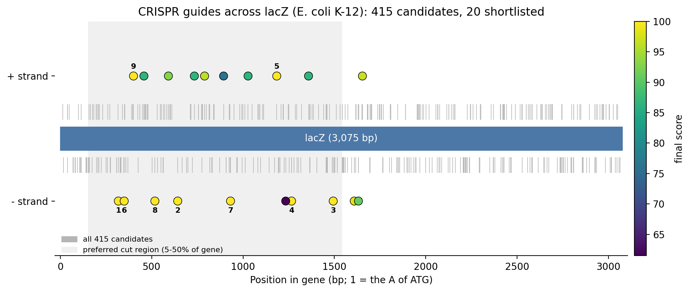
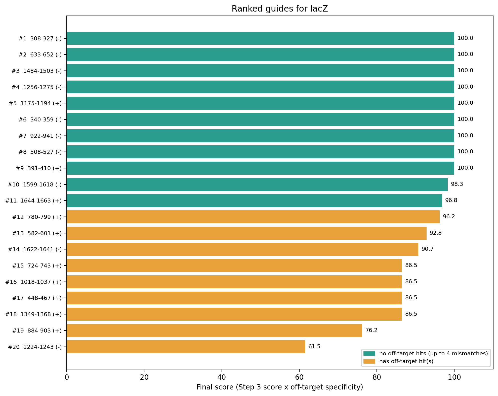
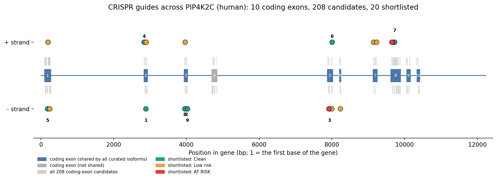
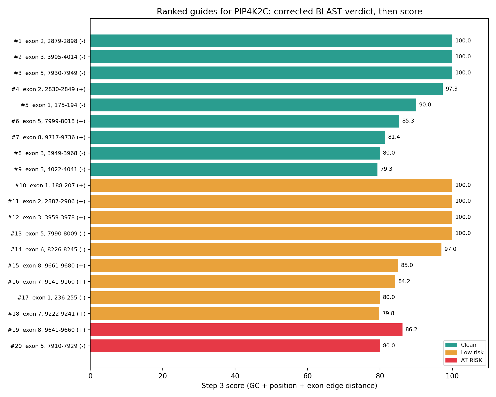
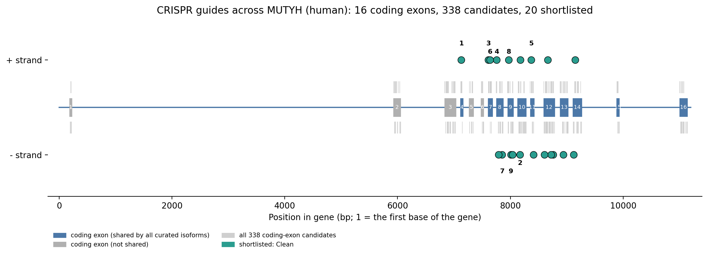
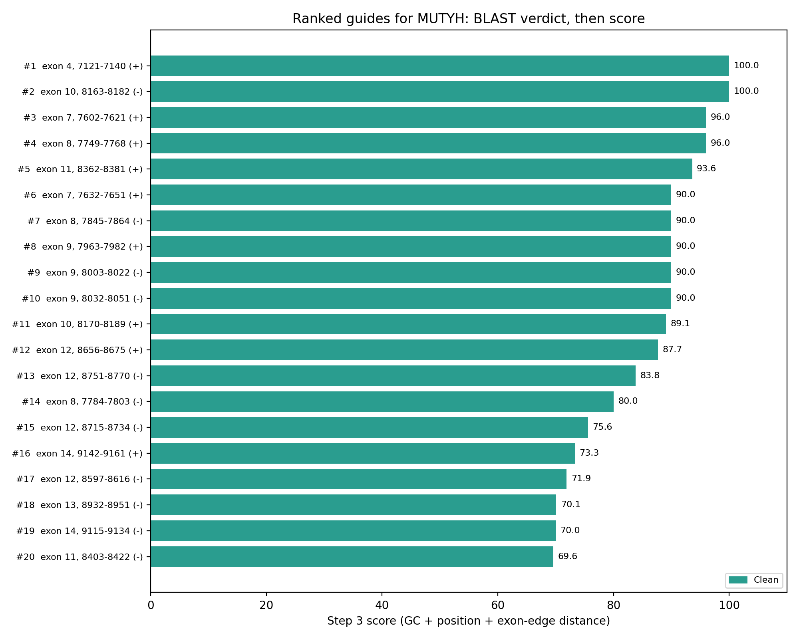
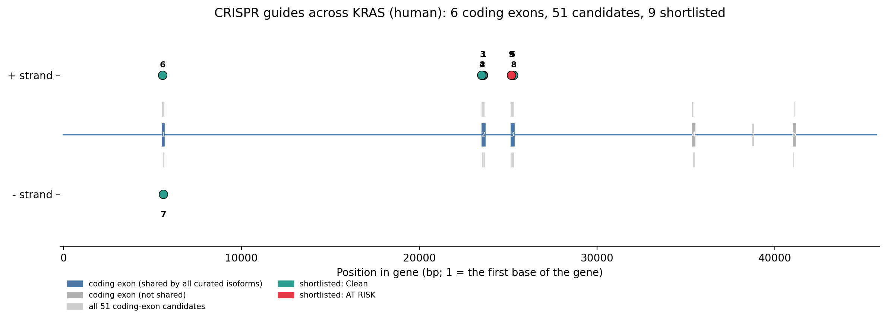
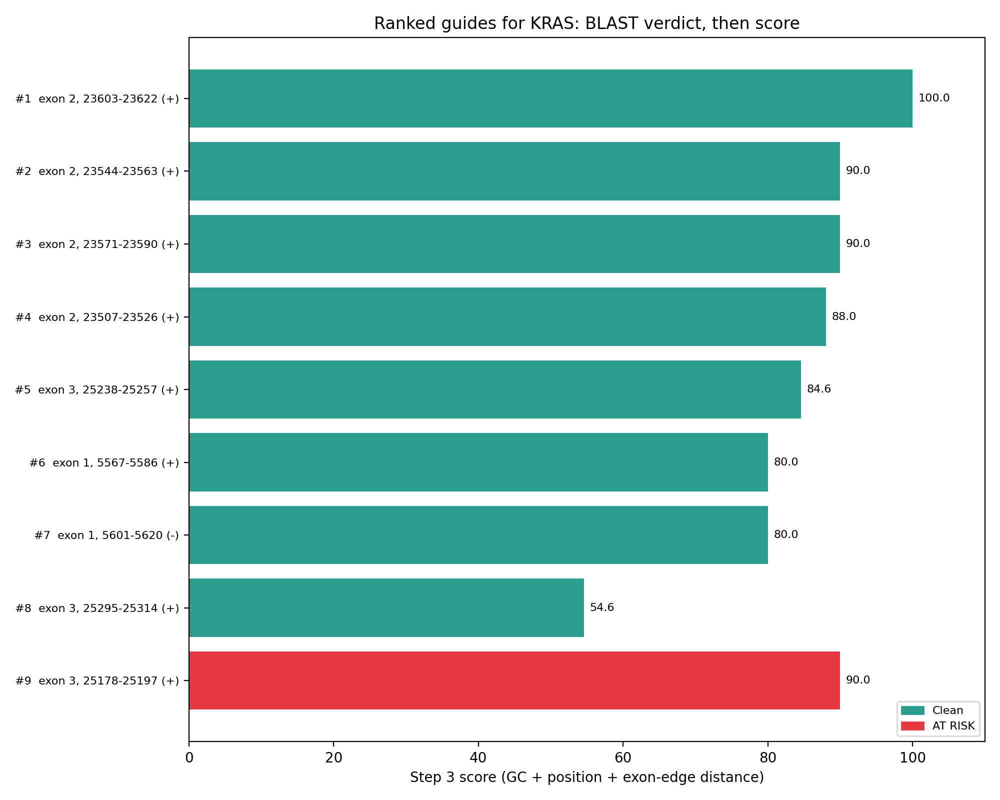
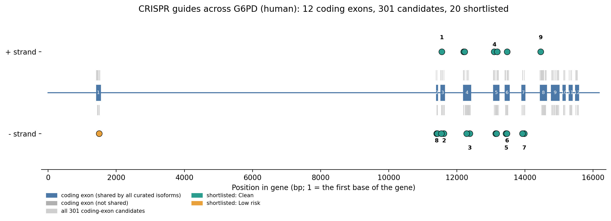
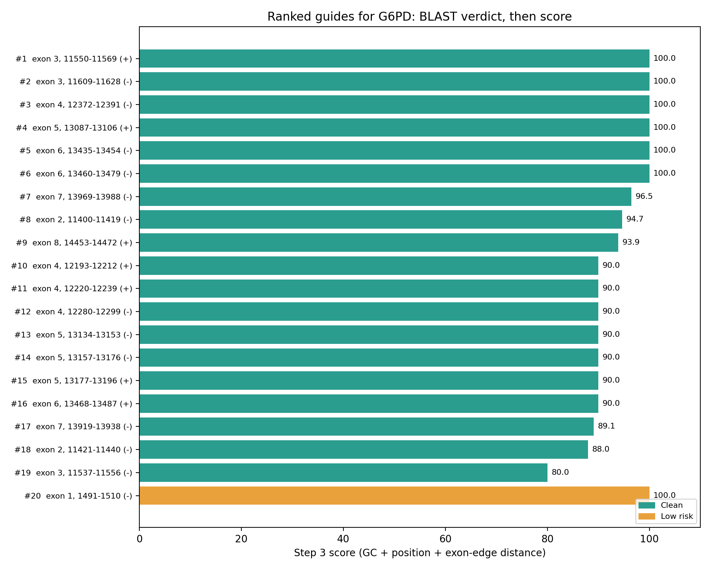

# CRISPR-GuideDesigner

A Python/Biopython pipeline that designs and ranks SpCas9 guide RNAs for a target gene, screens them for off-target sites, and validates the top picks against a published tool (CRISPOR).
CRISPR-GuideDesigner Workflow

The overall workflow of CRISPR-GuideDesigner, from NCBI gene-region retrieval and exon-aware guide design through BLAST-based off-target screening, CRISPOR validation, and final guide selection.

!"CRISPR-GuideDesigner Workflow" (results/workflow.png)

«Figure: General workflow of CRISPR-GuideDesigner. The pipeline processes one gene at a time, identifies coding-exon-targeting guides, ranks them using custom scoring, performs BLAST-based off-target screening, and validates shortlisted guides against CRISPOR before final selection.»


Important

The BLAST screen and CRISPOR validation are separate stages. CRISPOR is used as an external validation step to obtain MIT/CFD specificity scores and mismatch-count information; these values are not generated by the core BLAST pipeline itself.
**Case studies:**
1. *lacZ* in *E. coli* K-12 MG1655 (`NC_000913.3`) — proves the core pipeline with an exhaustive, genome-wide off-target search
2. **PIP4K2C** (human, chr12) — extends the pipeline to a eukaryotic gene with exons/introns, adds exon-aware filtering, a genomic BLAST off-target screen, and validation against CRISPOR
3. **MUTYH** (human, chr1) — a clinically established DNA-repair gene, contrasted with PIP4K2C's understudied kinase; full-shortlist CRISPOR validation revealed the project's central methodological limitation (see Phase 3 below)
4. **KRAS** (human, chr12) — the most commonly mutated oncogene in human cancer, chosen for its close paralogs (HRAS, NRAS) to directly test whether paralog count predicts off-target rate; confirmed from two independent directions (a KRASP1 pseudogene hit found by this project's own screen, and an NRAS exon hit found only by CRISPOR)
5. **G6PD** (human, chrX) — an X-linked, paralog-poor gene completing the 3-autosomal + 1-X-linked comparison; all 20 shortlisted guides validated against CRISPOR (5 of 20 agree), which shows the BLAST sensitivity gap is **not** explained by paralog count

> Developed on an Android tablet using Pydroid 3 and Google Colab.

## Why this project

Choosing a CRISPR guide is a genetics problem (where can Cas9 cut, and where might it cut by mistake?) that has to be solved computationally, because a single gene has hundreds of candidate sites and a genome has millions. This project encodes the biological rules of Cas9 targeting into code, step by step, and checks its own conclusions against real gene structure and an independent published tool rather than assuming its heuristics are correct.

---

## Case study 1: *E. coli lacZ*

### Pipeline

| Step | Script | What it does | Output |
|---|---|---|---|
| 1 | `src/fetch.py` | Downloads the *E. coli* genome from NCBI and extracts *lacZ* | `ecoli_genome.gb`, `lacZ.fasta` |
| 2 | `src/pam_finder.py` | Finds every NGG PAM on both strands and extracts the 20-nt guide in front of each | `guides_all.csv` |
| 3 | `src/scoring.py` | Filters (GC 40-60%, no TTTT/GGGG), scores, and shortlists 20 spaced-out guides | `guides_scored.csv`, `guides_shortlist.csv` |
| 4 | `src/offtarget.py` | Compares each guide with every NGG site in the genome (up to 4 mismatches, seed region weighted double) | `guides_final.csv`, `offtarget_hits.csv` |
| 5 | `src/plot_results.py` | Plots the guide map and ranking, and writes a summary | `guide_map.png`, `guide_ranking.png`, `summary.md` |

### Results (*lacZ*, 3,075 bp)

- **415** candidate guides (NGG PAM, both strands) -> **242** pass GC/motif filters -> **20** shortlisted
- **11 of 20** shortlisted guides have no off-target site up to 4 mismatches, checked against the **entire** *E. coli* genome





| Rank | Guide (5'-3') | PAM | Strand | Position | Score | Off-targets (0/1/2/3/4mm) |
|---|---|---|---|---|---|---|
| 1 | `CGTAATGGGATAGGTCACGT` | TGG | - | 308-327 | 100.0 | 0/0/0/0/0 |
| 2 | `TATGCAGCAACGAGACGTCA` | CGG | - | 633-652 | 100.0 | 0/0/0/0/0 |
| 3 | `GCAAATAATATCGGTGGCCG` | TGG | - | 1484-1503 | 100.0 | 0/0/0/0/0 |

Positions are inside the gene (1 = the A of the ATG start codon). Full table in `results/summary.md`.

---

## Case study 2: human PIP4K2C

PIP4K2C is a poorly-characterized lipid kinase -- chosen deliberately as an understudied gene, in contrast to a heavily-studied one like TP53. Unlike *lacZ*, it has introns, so a candidate guide's position relative to exon structure now matters.

### Pipeline

| Step | Script | What it does | Output |
|---|---|---|---|
| 1 | `src/phase2/phase2_fetch.py` | Downloads the PIP4K2C region from NCBI and builds a coding-exon table across all isoforms | `pip4k2c_gene.fasta`, `pip4k2c_exons.csv` |
| 2 | `src/phase2/exon_guides.py` | Finds every guide across the whole gene, keeps guides whose cut lands in a coding exon | `pip4k2c_guides_all.csv`, `pip4k2c_guides_coding.csv` |
| 3 | `src/phase2/exon_scoring.py` | Filters (GC, motifs, exon shared by all curated isoforms, not an NMD-escape zone, >=5 bp from a splice edge), scores, shortlists 20 | `pip4k2c_guides_scored.csv`, `pip4k2c_shortlist.csv` |
| 4 | `src/phase2/blast_offtargets_v_2.py` | Screens each guide with **genomic-only** NCBI BLAST (transcript/mRNA records excluded), collapses duplicate records into unique loci | `pip4k2c_blast_hits_genomic.csv`, `pip4k2c_unique_loci.csv` |
| 4b | `src/phase2/fix_self_hits.py` | Re-checks every hit's actual sequence against the gene itself, to catch self-matches under an unrelated accession that coordinate/text matching missed | `pip4k2c_offtarget_verdict_fixed.csv` |
| 5 | `src/phase2/exon_plot_results_colab.py` | Plots the exon/intron map and ranking, colored by verdict, and writes a summary | `pip4k2c_gene_map.png`, `pip4k2c_ranking.png`, `pip4k2c_summary.md` |

### Results (PIP4K2C, 12,227 bp, 1,266 nt CDS across 10 coding exons)

- **1,732** candidate guides across the whole gene -> **208** cut a coding exon -> **93** pass the exon-aware filters -> **20** shortlisted
- Off-target verdict after correction: **9 Clean, 9 Low risk, 2 AT RISK** (of 20)
  - AT RISK guides hit **PIP5K1C** (a related kinase) and **KCNQ1** (an unrelated cardiac ion-channel gene) with an adjacent PAM present
  - Exon 4 excluded (not shared by all curated isoforms); exons 9-10 largely excluded (nonsense-mediated-decay escape risk)





| Rank | Guide (5'-3') | PAM | Strand | Exon | Score | Verdict |
|---|---|---|---|---|---|---|
| 1 | `GAGCTGGCCTTAAAGTCATC` | TGG | - | 2 | 100.0 | Clean |
| 2 | `CAATGCCAAATCGATCACGG` | AGG | - | 3 | 100.0 | Clean |
| 3 | `CTTCGTTGTCCACACTGACT` | CGG | - | 5 | 100.0 | Clean |
| 4 | `TCAGATCAATGAGCTCAGCC` | AGG | + | 2 | 97.3 | Clean |
| 5 | `ATGCTTCTTCTTGGTCTTGG` | AGG | - | 1 | 90.0 | Clean |

Full 20-guide table in `results/phase2/pip4k2c_summary.md`.

---

## Phase 3: validation against CRISPOR

The 5 top "Clean" PIP4K2C guides above were run through [CRISPOR](https://crispor.tefor.net) (hg38) to check this pipeline's results against an independent, published tool. CRISPOR has no batch API suited to a tablet workflow, so its results were read from its results table by hand (`src/phase3/phase3_compare_crispor.py` documents the readings and builds the comparison).

| Guide | Exon | Our score | CRISPOR MIT spec. | CRISPOR CFD spec. | CRISPOR off-targets (0-1-2-3-4mm) | Result |
|---|---|---|---|---|---|---|
| `CAATGCCAAATCGATCACGG` | 3 | 100.0 | 95 | 97 | 0-0-0-2-27 | Agreement |
| `CTTCGTTGTCCACACTGACT` | 5 | 100.0 | 79 | 92 | 0-0-0-15-77 | Agreement |
| `ATGCTTCTTCTTGGTCTTGG` | 1 | 90.0 | 68 | 71 | 0-0-0-19-239 | Agreement |
| `TCAGATCAATGAGCTCAGCC` | 2 | 97.3 | 67 | 84 | 0-0-2-18-168 | Disagreement (CRISPOR also flags "Inefficient") |
| `GAGCTGGCCTTAAAGTCATC` | 2 | 100.0 | 44 | 90 | 0-1-1-14-79 | Disagreement |

**3 of 5 guides validated cleanly.** The other 2 were flagged by CRISPOR with off-target sites at 1-2 mismatches that this project's own BLAST screen missed -- most likely because CRISPOR uses a purpose-built, exhaustive genome index, while this project relies on NCBI's general-purpose BLAST search, which is less sensitive at finding very-close near-matches. This is recorded as a known limitation below rather than papered over.

**Final recommended PIP4K2C guides** (validated on both methods): `CAATGCCAAATCGATCACGG`, `CTTCGTTGTCCACACTGACT`, `ATGCTTCTTCTTGGTCTTGG`.

---

## Case study 3: human MUTYH

MUTYH (mutY DNA glycosylase) is a base-excision-repair enzyme; loss-of-function mutations cause MUTYH-associated polyposis, a hereditary colorectal cancer syndrome. Chosen deliberately to contrast with PIP4K2C: a clinically established gene rather than an understudied one, with 16 coding exons rather than 10, and (as it turned out) no close paralogs, unlike PIP4K2C's PIP4K2A/PIP4K2B family.

### Pipeline

Same five-script structure as PIP4K2C (`src/phase2/` scripts, retargeted), plus two MUTYH-specific additions: `mutyh_blast_offtargets.py` builds the genomic-only, sequence-verified self-hit check directly into the first run (no separate patch script needed, unlike PIP4K2C), and `mutyh_retry_flagged.py` is a small helper for forcing a re-check of specific guides.

| Step | Script | What it does | Output |
|---|---|---|---|
| 1 | `src/case3/mutyh_fetch.py` | Downloads the MUTYH region from NCBI and builds the coding-exon table | `mutyh_gene.fasta`, `mutyh_exons.csv` |
| 2 | `src/case3/mutyh_exon_guides.py` | Finds every guide across the whole gene, keeps guides whose cut lands in a coding exon | `mutyh_guides_all.csv`, `mutyh_guides_coding.csv` |
| 3 | `src/case3/mutyh_exon_scoring.py` | Filters and scores, shortlists 20 | `mutyh_guides_scored.csv`, `mutyh_shortlist.csv` |
| 4 | `src/case3/mutyh_blast_offtargets.py` | Genomic-only BLAST off-target screen with sequence-verified self-hit exclusion, built in from the start | `mutyh_unique_loci.csv`, `mutyh_offtarget_verdict.csv` |
| 5 | `src/case3/mutyh_plot_results_colab.py` | Plots the exon/intron map and ranking, writes a summary | `mutyh_gene_map.png`, `mutyh_ranking.png`, `mutyh_summary.md` |

### Results (MUTYH, 11,199 bp, 1,650 nt CDS across 16 coding exons)

- **1,799** candidate guides across the whole gene → **338** cut a coding exon → **89** pass the exon-aware filters → **20** shortlisted
- This project's own off-target screen found **0 off-target candidates for all 20** shortlisted guides -- see Phase 3 below for why this number alone is misleading
- Exons 1-6 excluded from the shortlist (not shared by all curated isoforms, matching MUTYH's known alternative-first-exon structure); exons 15-16 mostly excluded (NMD-escape risk)





Full 20-guide table in `results/case3/mutyh_summary.md`.

---

## Phase 3: validation against CRISPOR (both genes)

For PIP4K2C, the top 5 guides were checked (see above). For MUTYH, since this project's own screen found zero off-target candidates across the board, **all 20 shortlisted guides** were checked instead, to properly stress-test that result.

**MUTYH: only 3 of 20 guides (15%) validated cleanly** -- a much larger gap than PIP4K2C's 3-of-5 (60%).

| Guide | Exon | Our score | CRISPOR MIT spec. | CRISPOR CFD spec. | CRISPOR off-targets (0-1-2-3-4mm) | Result |
|---|---|---|---|---|---|---|
| `TGGGCTACTATTCTCGTGGC` | 7 | 90.0 | 90 | 97 | 0-0-0-5-63 | ✅ Agreement |
| `TGGTGGATGGCAACGTAGCA` | 9 | 90.0 | 88 | 92 | 0-0-0-8-89 | ✅ Agreement |
| `TGCAGGGTCTCTGCTGTACG` | 8 | 80.0 | 87 | 92 | 0-0-0-8-99 | ✅ Agreement |
| ...17 more guides | | | | | | ⚠️ Disagreement (2 also flagged "Inefficient") |

Full 20-row table in `results/case3/mutyh_phase3_comparison.csv` and `results/case3/mutyh_phase3_summary.md`.

**Final recommended MUTYH guides** (validated on both methods): `TGGGCTACTATTCTCGTGGC`, `TGGTGGATGGCAACGTAGCA`, `TGCAGGGTCTCTGCTGTACG`.

---

## Case study 4: human KRAS

KRAS (KRAS proto-oncogene, GTPase) is the most commonly mutated oncogene in human cancer (lung, colorectal, pancreatic). Chosen deliberately for its close paralogs HRAS and NRAS, to directly test whether paralog count predicts off-target rate — the opposite structural bet from MUTYH, which has none.

### Pipeline

Same structure as MUTYH (`src/case3/` scripts, retargeted), with the genomic-only, sequence-verified self-hit check built in from the start (`kras_blast_offtargets.py`).

| Step | Script | What it does | Output |
|---|---|---|---|
| 1 | `src/case4/kras_fetch.py` | Downloads the KRAS region from NCBI and builds the coding-exon table | `kras_gene.fasta`, `kras_exons.csv` |
| 2 | `src/case4/kras_exon_guides.py` | Finds every guide across the whole gene, keeps guides whose cut lands in a coding exon | `kras_guides_all.csv`, `kras_guides_coding.csv` |
| 3 | `src/case4/kras_exon_scoring.py` | Filters and scores, shortlists up to 20 (fewer candidates exist for this gene) | `kras_guides_scored.csv`, `kras_shortlist.csv` |
| 4 | `src/case4/kras_blast_offtargets.py` | Genomic-only BLAST off-target screen with sequence-verified self-hit exclusion | `kras_unique_loci.csv`, `kras_offtarget_verdict.csv` |
| 5 | `src/case4/kras_plot_results_colab.py` | Plots the exon/intron map and ranking, writes a summary | `kras_gene_map.png`, `kras_ranking.png`, `kras_summary.md` |

### Results (KRAS, 45,684 bp, 684 nt CDS across 6 coding exons)

- **3,875** candidate guides across the whole gene → only **51** cut a coding exon (KRAS's coding sequence is tiny relative to its 45.7 kb gene, mostly one large intron) → **21** pass the exon-aware filters → **9** shortlisted (fewer than the target of 20, since so few candidates exist)
- Exon 5 is only 1 nt long (a known feature of KRAS's alternative terminal-exon splicing) and attracted zero guides, as expected
- This project's own off-target screen found **8 Clean, 1 AT RISK** (of 9): `GGACTCTGAAGATGTACCTA` hits **KRASP1**, a processed pseudogene of KRAS itself on chromosome 6 — not HRAS/NRAS as originally hypothesized, but the same underlying principle (a near-identical genomic duplicate)





Full 9-guide table in `results/case4/kras_summary.md`.

---

## Phase 3: validation against CRISPOR (KRAS)

All 9 shortlisted KRAS guides were checked against CRISPOR, across three small windows covering the gene's three exon clusters.

**Only 1 of 9 guides (11%) validated cleanly** — the smallest agreement rate of the genes checked.

| Guide | Exon | Our verdict | CRISPOR MIT spec. | CRISPOR CFD spec. | CRISPOR off-targets (0-1-2-3-4mm) | NRAS exon hit? | Result |
|---|---|---|---|---|---|---|---|
| `CTGAATTAGCTGTATCGTCA` | 1 | Clean | 75 | 93 | 1-0-0-14-62 | | ✅ Agreement |
| `TCTCGACACAGCAGGTCAAG` | 2 | Clean | 80 | 90 | 0-0-1-12-89 | | ⚠️ Disagreement |
| `CAATGAGGGACCAGTACATG` | 2 | Clean | 79 | 91 | 0-0-1-13-116 | **Yes** | ⚠️ Disagreement |
| `TCCCTTCTCAGGATTCCTAC` | 2 | Clean | 76 | 84 | 0-0-3-17-151 | | ⚠️ Disagreement |
| `GGACTCTGAAGATGTACCTA` | 3 | **AT RISK** | 67 | 81 | 0-1-3-28-189 | **Yes** | ⚠️ Disagreement |
| `GTAGTTGGAGCTGGTGGCGT` | 1 | Clean | 54 | 75 | 1-0-2-21-277 | | ⚠️ Disagreement |
| `AACATCAGCAAAGACAAGAC` | 3 | Clean | 53 | 71 | 0-0-1-40-353 | | ⚠️ Disagreement |
| `AGTAGACACAAAACAGGCTC` | 3 | Clean | 53 | 81 | 0-0-7-103-213 | | ⚠️ Disagreement |
| `TGATGGAGAAACCTGTCTCT` | 2 | Clean | 38 | 79 | 1-0-6-37-211 | | ⚠️ Disagreement (also "Inefficient") |

*(a leading "1" in the 0-mismatch slot is the guide's own on-target site being counted by CRISPOR, not a red flag)*

**On this one gene, the paralog mechanism is confirmed from two independent directions.** `CAATGAGGGACCAGTACATG` and `GGACTCTGAAGATGTACCTA` both show an off-target landing directly inside an **NRAS exon** in CRISPOR's own results — the functional-paralog hit originally predicted. Combined with this project's own screen finding the KRASP1 pseudogene hit independently, KRAS's off-target risk comes from *both* a near-identical genomic duplicate (found by BLAST) and a true functional paralog (found only by CRISPOR's more sensitive search). Whether paralog count predicts off-target risk *across genes* is a separate question, taken up after the G6PD case study below.

**Final recommended KRAS guide** (the only one validated on both methods): `CTGAATTAGCTGTATCGTCA`.

---

## Case study 5: human G6PD

G6PD (glucose-6-phosphate dehydrogenase) sits on the X chromosome (Xq28); its deficiency (G6PD deficiency, "favism") is among the most common human enzyme deficiencies. Chosen as the **X-linked, paralog-poor** contrast to KRAS (its closest paralog is H6PD), completing the planned 3-autosomal + 1-X-linked comparison.

### Pipeline

Same structure as KRAS (`src/case4/` scripts, retargeted), with the genomic-only, sequence-verified self-hit check built in from the start (`g6pd_blast_offtargets.py`), plus a standalone re-verification helper (`g6pd_retry_flagged.py`).

| Step | Script | What it does | Output |
|---|---|---|---|
| 1 | `src/case5/g6pd_fetch.py` | Downloads the G6PD region from NCBI (minus strand, flipped to 5'->3' gene orientation) and builds the coding-exon table | `g6pd_gene.fasta`, `g6pd_exons.csv` |
| 2 | `src/case5/g6pd_exon_guides.py` | Finds every guide across the whole gene, keeps guides whose cut lands in a coding exon | `g6pd_guides_all.csv`, `g6pd_guides_coding.csv` |
| 3 | `src/case5/g6pd_exon_scoring.py` | Filters and scores, shortlists 20 | `g6pd_guides_scored.csv`, `g6pd_shortlist.csv` |
| 4 | `src/case5/g6pd_blast_offtargets.py` | Genomic-only BLAST off-target screen with sequence-verified self-hit exclusion | `g6pd_unique_loci.csv`, `g6pd_offtarget_verdict.csv` |
| 4b | `src/case5/g6pd_retry_flagged.py` | Re-BLASTs guides whose verdict could hide a swallowed error; self-hits are detected offline against the gene sequence and every hit gets a logged reason | `g6pd_retry_hits.csv`, `g6pd_retry_verdict.csv` |
| 5 | `src/case5/g6pd_plot_results_colab.py` | Plots the exon/intron map and ranking, writes a summary | `g6pd_gene_map.png`, `g6pd_ranking.png`, `g6pd_summary.md` |

### Results (G6PD, 16,180 bp, 1,548 nt CDS across 12 coding exons)

- **3,057** candidate guides across the whole gene → **301** cut a coding exon → **138** pass the exon-aware filters → **20** shortlisted (the full target, unlike KRAS), spread across exons 1-8
- Unlike the other genes, **no candidate failed the isoform filter**: every coding exon is shared by all curated isoforms. Candidates failed the other filters as follows (not exclusive): GC 120, motif 34, NMD-escape zone 30, splice-edge distance 16
- No shortlisted guides in exons 9-12 (the 3' end): the position score favours cuts early in the coding sequence
- This project's own off-target screen found **19 Clean, 1 Low risk, 0 AT RISK** (of 20). The Low risk guide (`GTGTGTATCCGACTGATGGA`) has one non-self locus with no adjacent PAM
- **Provisional:** a re-check of 7 guides (`g6pd_retry_flagged.py`) reproduced every verdict, but in all 50 BLAST hits returned per guide, 100% were G6PD's own records. G6PD is so heavily sequenced that its own database entries can fill the hit list and push weaker off-target sites out of view, so "Clean" here is read as "no non-self hit within the first 50 alignments" (see Limitations)
- **Exon numbering:** this project numbers *coding* exons from 1, so "exon 1" here is the first coding exon, which is very likely exon 2 in the clinical literature (G6PD's literature exon 1 is non-coding). Check against NCBI before comparing exon numbers with papers





| Rank | Guide (5'-3') | PAM | Strand | Exon | Score | Verdict |
|---|---|---|---|---|---|---|
| 1 | `CCCGAAAACACCTTCATCGT` | GGG | + | 3 | 100.0 | Clean |
| 2 | `AGAAGGGCTCACTCTGTTTG` | CGG | - | 3 | 100.0 | Clean |
| 3 | `GCAGGACTCGTGAATGTTCT` | TGG | - | 4 | 100.0 | Clean |
| 4 | `ATCATCGTGGAGAAGCCCTT` | CGG | + | 5 | 100.0 | Clean |
| 5 | `ATGTTGTCCCGGTTCCAGAT` | GGG | - | 6 | 100.0 | Clean |

Ranked by verdict, then score. Full 20-guide table in `results/case5/g6pd_summary.md`.

---

## Phase 3: validation against CRISPOR (G6PD)

All 20 shortlisted G6PD guides were checked against CRISPOR (hg38), across five small windows (gene positions 1350-1650, 11300-11750, 12100-12500, 13000-13600, 13850-14550) covering exons 1-8.

**Only 5 of 20 guides (25%) validated cleanly.**

| Guide | Exon | Our score | Our verdict | CRISPOR MIT spec. | CRISPOR CFD spec. | CRISPOR off-targets (0-1-2-3-4mm) | Known variant? | Result |
|---|---|---|---|---|---|---|---|---|
| `ATCACGGACGTCATCTGAGT` | 7 | 96.5 | Clean | 94 | 96 | 0-0-0-4-26 |  | ✅ Agreement |
| `CCCGAAAACACCTTCATCGT` | 3 | 100.0 | Clean | 94 | 98 | 0-0-0-3-34 | Yes | ✅ Agreement |
| `GATCTGGTCCTCACGGAACA` | 5 | 90.0 | Clean | 92 | 94 | 0-0-0-7-61 |  | ✅ Agreement |
| `TACCGCATCGACCACTACCT` | 5 | 90.0 | Clean | 89 | 98 | 0-0-0-3-24 |  | ✅ Agreement |
| `GTGTGTATCCGACTGATGGA` | 1 | 100.0 | Low risk | 85 | 92 | 0-0-0-5-72 |  | ✅ Agreement |
| ...15 more guides | | | | | | | | ⚠️ Disagreement (5 also flagged "Inefficient") |

Full 20-row table in `results/case5/g6pd_phase3_comparison.csv` and `results/case5/g6pd_phase3_summary.md`.

*(In this run CRISPOR reported 0 in the 0-mismatch slot for every guide, so, unlike the KRAS run, no leading "1" appears; as before, only the 1- and 2-mismatch slots decide the verdict.)*

All 15 disagreements have 2-mismatch hits; one (`AGAGGAGAAGCTCAAGCTGG`, which also has MIT specificity 42) additionally has a 1-mismatch hit. The 5 guides CRISPOR flags "Inefficient" are all among the disagreements.

**This gap is not explained by paralogs.** G6PD has only one paralog (H6PD), yet 15 of 20 guides still show close CRISPOR hits, and the genome-browser annotations CRISPOR displays (top three per guide) are mostly intergenic or intronic loci, none of them H6PD. Agreement for G6PD (5/20) is similar to MUTYH (3/20, no paralogs) and not clearly better than the paralog-rich KRAS (1/9).

**Variant caution:** `CCCGAAAACACCTTCATCGT` passes both screens but overlaps a known sequence variant in CRISPOR's display. G6PD is highly polymorphic, so a guide overlapping a variant may fail to cut in carriers; three other shortlisted guides (`CTTTGCCCGCAACTCCTATG`, `ATCATCGTGGAGAAGCCCTT`, `AGGAGATGTGGTTGGACAGC`) carry one too.

**Final recommended G6PD guides** (validated on both methods, no overlapping known variant): `ATCACGGACGTCATCTGAGT`, `GATCTGGTCCTCACGGAACA`, `TACCGCATCGACCACTACCT`, `GTGTGTATCCGACTGATGGA`.

---

## The central methodological finding

Confirmed across **four human genes** now: this project's BLAST-based off-target screen (`word_size=7`) systematically misses off-target sites where 1-2 mismatches are spread across the guide's 20 bp, because such a hit often contains no 7-bp perfectly-matching stretch for BLAST to seed on. CRISPOR's purpose-built aligner has no such blind spot.

| Gene | Paralogs | Guides checked | Validated cleanly |
|---|---|---|---|
| PIP4K2C | PIP4K2A/B family | 5 (top "Clean" picks) | 3/5 (60%) |
| MUTYH | none close | 20 | 3/20 (15%) |
| KRAS | HRAS, NRAS, KRASP1 pseudogene | 9 | 1/9 (11%) |
| G6PD | H6PD only | 20 | 5/20 (25%) |

This means **"0 off-target candidates" or "Clean" from this project's own screen should be read as "0 candidates BLAST's seed-based search could find," not as a guarantee of true specificity** — a materially different, more honest claim, and the single most important limitation of this project.

**What the four genes do and do not show about paralogs.** KRAS confirms the *mechanism* directly: its off-target risk came from a near-identical pseudogene (KRASP1, found by BLAST) and a true paralog (NRAS, found only by CRISPOR). But *across* genes, agreement rates do not track paralog count: the paralog-poor G6PD (25%) and the paralog-free MUTYH (15%) fall in the same range as the paralog-rich KRAS (11%). With four genes, different shortlist sizes, and PIP4K2C's small hand-picked sample, this project cannot claim that paralog count predicts CRISPOR-detected off-target risk. What it shows consistently is that a `word_size=7` BLAST screen alone under-reports close off-targets, whatever the gene.

---

## How genetics and bioinformatics are integrated

| Genetics | Bioinformatics |
|---|---|
| Cas9 needs an NGG PAM next to the target | String scan of both strands using reverse complement |
| Guide efficiency depends on GC content | GC filter and scoring with `Bio.SeqUtils` |
| Coding exons, especially early ones, give the best knockouts | GenBank feature parsing, exon-based filtering and ranking |
| Mismatches near the PAM (seed region) block cutting most strongly | Seed-weighted mismatch counting (Phase 1) |
| A frameshift near the last exon may escape nonsense-mediated decay | Cut-position rule excluding NMD-escape zones (Phase 2/3) |
| Cutting near a splice junction risks abnormal splicing | Minimum distance-from-exon-edge filter (Phase 2/3) |
| Off-target cuts cause unwanted mutations | Genome-wide comparison against all NGG sites (Phase 1), genomic-only BLAST with sequence-verified self-hit exclusion (Phase 2/3) |
| Genes with close paralogs are inherently harder to target uniquely | Cross-gene comparison of off-target rates: KRAS confirms the mechanism (pseudogene hit by BLAST, NRAS exon hit by CRISPOR), but agreement rates across PIP4K2C, MUTYH, KRAS and G6PD do not track paralog count |
| Common sequence variants (G6PD is highly polymorphic) can stop a guide from cutting | CRISPOR's variant display read per guide; guides overlapping a known variant are excluded from the final G6PD recommendation |
| Published tools are the field's benchmark | Comparison against CRISPOR's own scores and off-target calls (Phase 3, all human genes) |

## Run it

```bash
pip install -r requirements.txt
# open each fetch/blast script and set Entrez.email to your own email address

# Case study 1: E. coli lacZ
python src/fetch.py
python src/pam_finder.py
python src/scoring.py
python src/offtarget.py
python src/plot_results.py

# Case study 2: human PIP4K2C
python src/phase2/phase2_fetch.py
python src/phase2/exon_guides.py
python src/phase2/exon_scoring.py
python src/phase2/blast_offtargets_v_2.py
python src/phase2/fix_self_hits.py
python src/phase2/exon_plot_results_colab.py   # Colab: prompts for input files, downloads outputs
python src/phase3/phase3_compare_crispor.py

# Case study 3: human MUTYH
python src/case3/mutyh_fetch.py
python src/case3/mutyh_exon_guides.py
python src/case3/mutyh_exon_scoring.py
python src/case3/mutyh_blast_offtargets.py
python src/case3/mutyh_retry_flagged.py        # only if a guide needs re-verification
python src/case3/mutyh_plot_results_colab.py   # Colab: prompts for input files, downloads outputs
python src/case3/mutyh_compare_crispor.py

# Case study 4: human KRAS
python src/case4/kras_fetch.py
python src/case4/kras_exon_guides.py
python src/case4/kras_exon_scoring.py
python src/case4/kras_blast_offtargets.py
python src/case4/kras_plot_results_colab.py    # Colab: prompts for input files, downloads outputs
python src/case4/kras_compare_crispor.py

# Case study 5: human G6PD
python src/case5/g6pd_fetch.py
python src/case5/g6pd_exon_guides.py
python src/case5/g6pd_exon_scoring.py
python src/case5/g6pd_blast_offtargets.py
python src/case5/g6pd_retry_flagged.py         # re-verifies flagged guides; set Entrez.email first
python src/case5/g6pd_plot_results_colab.py    # Colab: prompts for input files, downloads outputs
python src/case5/g6pd_compare_crispor.py
```

Run scripts from the repository root; inputs/outputs are read from and written to the current folder. Large genome files (`ecoli_genome.gb`, `pip4k2c_region.gb`, `mutyh_region.gb`, `kras_region.gb`) are git-ignored.

## Limitations

- **This project's BLAST-based off-target screen (`word_size=7`) systematically misses off-targets where 1-2 mismatches are spread across the guide, confirmed across all four human genes checked (PIP4K2C, MUTYH, KRAS, G6PD) via CRISPOR validation, with agreement rates of 60%, 15%, 11% and 25%.** A "0 off-target candidates" or "Clean" result from this project's own screen means no 7-bp-seedable hit was found, not that the guide is truly free of off-targets. This is the project's central methodological finding, not a per-gene quirk.
- **BLAST hit-list saturation (G6PD).** The screen requests the top 50 BLAST alignments per guide. For G6PD, every one of the 50 alignments returned for the 7 guides re-checked was a G6PD record, so weaker off-target sites may lie beyond the list. A genomic-records-only, larger-hit-list rerun (settings are in `g6pd_retry_flagged.py`) has not yet been run across all 20 guides; G6PD "Clean" calls are provisional until it is.
- **Agreement rates are not strictly comparable across genes:** PIP4K2C's 5 guides were the hand-picked top "Clean" ones, KRAS had only 9 candidates, and MUTYH and G6PD had 20 each. With four genes, no conclusion about paralog count can be drawn.
- **CRISPOR results were read by hand from its results table** (no batch API suited to a tablet workflow), then cross-checked against the shortlist CSV for exon and score; transcription errors are possible even with that check.
- **Known sequence variants** shown by CRISPOR can overlap a guide (four G6PD shortlisted guides do); a guide overlapping a variant may not cut in carriers.
- **Exon numbers count coding exons only**, so they differ from literature exon numbering for genes with a non-coding first exon (e.g. G6PD).
<!-- The rest of the original Limitations list (starting at "The scores a...") and the Roadmap were cut off in the copy used for this edit. Paste them below. Tick the G6PD roadmap checkbox, and change any "3 genes" wording to "4 genes". -->
