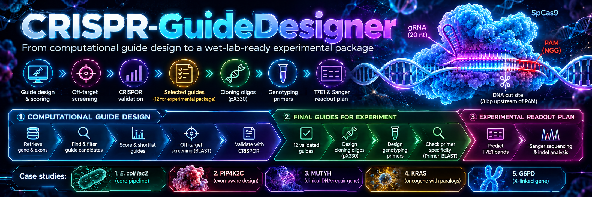
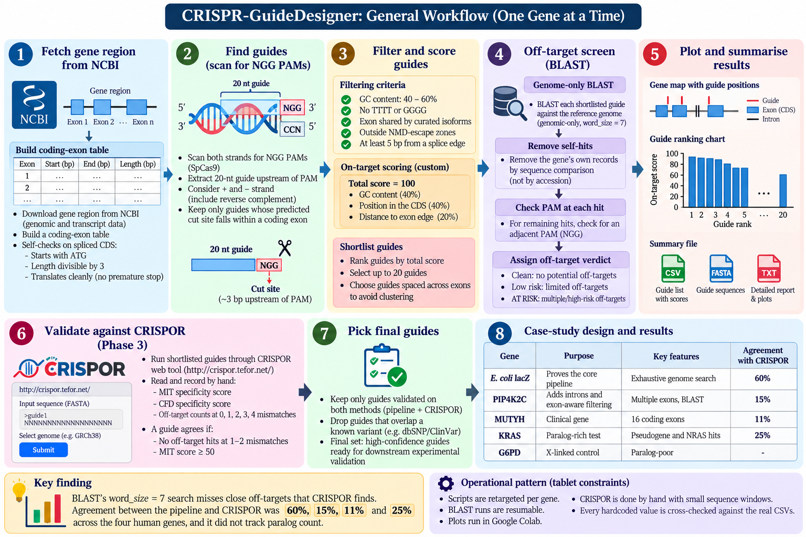
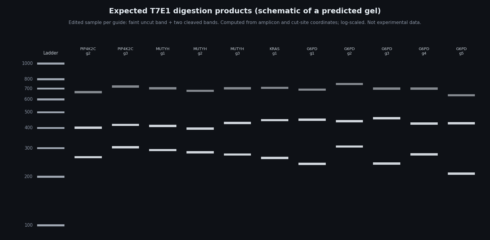

# CRISPR-GuideDesigner
### From computational guide discovery to a wet-lab-ready CRISPR design package

<p align="center">
  
</p>

**Author:** Soumojit Ghosh  
**Status:** Computationally designed; **not yet wet-lab validated**

CRISPR-GuideDesigner is a Python/Biopython workflow for designing, ranking and evaluating SpCas9 guide RNAs for target genes. The project has now been extended beyond guide selection into a downstream experimental-design package containing cloning oligos, genotyping primers and predicted T7E1/Sanger readouts.

> **Important:** All guide, oligo and primer designs in this repository are computational. None has been validated in cells or in the laboratory.

---

## 1. Project overview

The project is organized as a continuous pipeline:

```text
NCBI gene retrieval
        ↓
PAM / guide discovery
        ↓
Coding-exon and gene-structure filtering
        ↓
Guide scoring and ranking
        ↓
Genome-wide off-target screening
        ↓
CRISPOR cross-validation
        ↓
Final guide selection
        ↓
Guide genomic localization
        ↓
Cas9 cloning oligo design
        ↓
Genotyping primer design
        ↓
Primer-BLAST specificity check
        ↓
Predicted T7E1 readout
        ↓
Sanger sequencing / indel-analysis plan
```



**Figure:** End-to-end workflow from NCBI retrieval and exon-aware guide design through off-target screening, CRISPOR validation, and downstream experimental design.

The key idea is that **guide selection and experimental validation should not be treated as separate projects**. A guide is useful only when its genomic location, specificity, cloning requirements and downstream genotyping strategy can all be defined.

---

## 2. What the repository does

### Upstream: CRISPR guide design

For one gene at a time, the pipeline:

- retrieves the relevant sequence from NCBI;
- identifies SpCas9-compatible **NGG PAM** sites on both strands;
- extracts candidate 20-nt guide sequences;
- evaluates GC content and undesirable sequence motifs;
- maps candidate cuts to coding exons;
- considers isoform structure, splice-edge distance and NMD-escape regions;
- scores and ranks candidate guides;
- performs genomic off-target screening;
- collapses duplicate database records into unique loci;
- validates shortlisted guides against **CRISPOR**.

### Downstream: experimental design

For guides that survive the computational screening, the extended package:

- selects the final guide set;
- locates each guide and its predicted Cas9 cut position on **GRCh38**;
- designs cloning oligos for a pX330-style construct;
- designs PCR genotyping primers around each cut site;
- checks primer specificity with **NCBI Primer-BLAST**;
- predicts T7E1 digestion products;
- plans Sanger sequencing and downstream indel analysis.

---

## 3. Case studies

The guide-design pipeline has been tested on five genes:

1. ***lacZ*** in *E. coli* K-12 MG1655 (`NC_000913.3`) — establishes the core genome-wide workflow.
2. **PIP4K2C** — human chr12; introduces exon-aware design and genomic BLAST screening.
3. **MUTYH** — human chr1; tests the workflow on a clinically established DNA-repair gene.
4. **KRAS** — human chr12; tests off-target behavior in a gene with close paralogs and a related pseudogene.
5. **G6PD** — human chrX; provides an X-linked, paralog-poor comparison and exposes BLAST hit-list saturation.

The downstream wet-lab design package currently uses **12 final guides across four human genes: PIP4K2C, MUTYH, KRAS and G6PD**.

---

# Part I — Computational guide design

## 4. Why this project?

CRISPR guide selection is fundamentally a genetics problem:

> **Where can Cas9 cut, and where might it cut by mistake?**

A gene can contain hundreds or thousands of possible target sites, while the genome contains millions of potential near-matches. A useful computational workflow therefore has to combine sequence analysis with biological context.

This project translates those rules into a reproducible pipeline and then tests its own predictions against **CRISPOR**, rather than treating the custom scoring system as a definitive answer.

---

## 5. Core guide-design workflow

| Step | Purpose | Main output |
|---|---|---|
| 1 | Retrieve gene/genomic sequence from NCBI | FASTA / GenBank |
| 2 | Identify NGG PAMs on both strands | Candidate guide table |
| 3 | Filter by GC content and sequence motifs | Filtered candidates |
| 4 | Map guides to coding exons | Coding-exon guide table |
| 5 | Apply isoform, NMD and splice-edge rules | Exon-aware candidates |
| 6 | Score and rank guides | Ranked shortlist |
| 7 | Screen for genomic off-targets | Off-target tables |
| 8 | Verify top candidates with CRISPOR | Cross-validation |
| 9 | Select guides supported by both approaches | Final guide set |

### Biological rules encoded in the workflow

| Genetics / molecular biology rule | Computational implementation |
|---|---|
| SpCas9 requires an NGG PAM | Both-strand PAM scanning |
| Guide performance is influenced by GC content | GC filtering/scoring |
| Coding-exon disruption is preferred for knockout designs | GenBank feature parsing and exon filtering |
| Early coding cuts are generally preferable for knockout designs | Position scoring |
| Cuts too close to the last exon can risk NMD escape | NMD-escape filtering |
| Cutting close to splice boundaries can complicate interpretation | Minimum exon-edge distance |
| PAM-proximal mismatches are more consequential | Seed-weighted mismatch scoring |
| Genomic near-matches can produce off-target cutting | Genome/BLAST off-target screening |
| Close paralogs and pseudogenes can complicate specificity | Cross-gene off-target analysis |
| Natural variants can alter guide binding | CRISPOR variant inspection |

---

## 6. Case study summary

### 6.1 *E. coli lacZ*

The original bacterial case study establishes the core workflow using an exhaustive genome-wide comparison.

- **415** candidate NGG guides
- **242** passed GC/motif filters
- **20** shortlisted
- **11/20** had no detected off-target site up to four mismatches in the *E. coli* genome


---

### 6.2 Human PIP4K2C

PIP4K2C introduced exon-aware design to a eukaryotic gene containing introns and multiple curated isoforms.

- **1,732** candidates
- **208** cut coding exons
- **93** passed exon-aware filters
- **20** shortlisted
- Own screen: **9 Clean, 9 Low risk, 2 AT RISK**

The top computational candidates were then checked against CRISPOR.

**3/5** of the top Clean candidates validated cleanly by both approaches.

Final guides carried forward:

```text
CAATGCCAAATCGATCACGG
CTTCGTTGTCCACACTGACT
ATGCTTCTTCTTGGTCTTGG
```

---

### 6.3 Human MUTYH

MUTYH was selected as a clinically established DNA-repair gene with 16 coding exons and no close paralog.

- **1,799** candidates
- **338** cut coding exons
- **89** passed exon-aware filters
- **20** shortlisted
- Own BLAST screen initially found **0 off-target candidates**

CRISPOR validation showed that this apparently clean result was overly optimistic:

**3/20 (15%)** validated cleanly.

Final guides carried forward:

```text
TGGGCTACTATTCTCGTGGC
TGGTGGATGGCAACGTAGCA
TGCAGGGTCTCTGCTGTACG
```

---

### 6.4 Human KRAS

KRAS was chosen because of its close paralogs **HRAS** and **NRAS**, allowing the project to test whether related genes increase off-target risk.

- **3,875** candidates
- **51** cut coding exons
- **21** passed filters
- **9** shortlisted
- Own screen: **8 Clean, 1 AT RISK**

The AT RISK guide:

```text
GGACTCTGAAGATGTACCTA
```

hit the KRASP1 pseudogene in the project's screen.

CRISPOR additionally identified an **NRAS exon hit** for two guides, confirming that the paralog mechanism is biologically relevant.

Only **1/9 (11%)** shortlisted guides validated cleanly.

Final guide carried forward:

```text
CTGAATTAGCTGTATCGTCA
```

---

### 6.5 Human G6PD

G6PD provides an X-linked, relatively paralog-poor comparison.

- **3,057** candidates
- **301** cut coding exons
- **138** passed filters
- **20** shortlisted
- Own screen: **19 Clean, 1 Low risk**

However, G6PD exposed a major limitation: its highly represented genomic records can saturate the BLAST hit list. Therefore, its Clean calls are considered **provisional**.

CRISPOR validation:

**5/20 (25%)** validated cleanly.

Final guides carried forward into the downstream package:

```text
ATCACGGACGTCATCTGAGT
CCCGAAAACACCTTCATCGT
GATCTGGTCCTCACGGAACA
TACCGCATCGACCACTACCT
GTGTGTATCCGACTGATGGA
```

One of these five (`CCCGAAAACACCTTCATCGT`, G6PD_g2) overlaps a known sequence variant. It is kept in the package but flagged; the genotype of the experimental cell line should be checked before using it.

---

## 7. Central methodological finding

The most important result of the project is not a particular guide sequence.

It is a limitation of the off-target methodology.

Across four human genes, the project's BLAST-based screen using `word_size=7` can miss close off-targets when the mismatches are distributed across the 20-nt guide and no suitable 7-bp exact seed is available for BLAST to initiate the search.

| Gene | Paralogs / related loci | Guides checked | Validated cleanly |
|---|---|---:|---:|
| PIP4K2C | PIP4K2A/B family | 5 | 3/5 (60%) |
| MUTYH | No close paralog | 20 | 3/20 (15%) |
| KRAS | HRAS, NRAS, KRASP1 | 9 | 1/9 (11%) |
| G6PD | H6PD | 20 | 5/20 (25%) |

Therefore:

> **A "Clean" result from this project's BLAST screen means that no candidate was detected by that search strategy. It does not prove that the guide is free of off-target sites.**

CRISPOR is therefore used as an independent validation layer rather than as a decorative comparison.

---

# Part II — From final guides to experimental design

## 8. The downstream design package

Once guides were selected from the computational pipeline, the project was extended into a design package that answers the next practical questions:

1. Where exactly does Cas9 cut?
2. What oligos are needed to clone each guide?
3. Where should genotyping primers be placed?
4. Is each primer pair sufficiently specific?
5. What T7E1 pattern should be expected?
6. How should Sanger sequencing be used to quantify indels?

The downstream package currently contains **12 final guide designs across four human genes**. Package-level documentation is in [`wetlab_design/README.md`](wetlab_design/README.md).

---

## 9. Downstream workflow

| Step | What happens | Script / tool | Output |
|---|---|---|---|
| 1 | Select guides where the project's verdict agrees with CRISPOR | `make_final_guides.py` | `final_guides.csv` |
| 2 | Locate guide, PAM, strand and Cas9 cut position on GRCh38 | `primer_design.py` / localization workflow | `final_guides_located.csv` |
| 3 | Design cloning oligos for pX330 | `make_oligos.py` | `oligo_order.csv` |
| 4 | Design genotyping amplicons and primers around each cut | `primer_design.py` | primer/amplicon tables |
| 5 | Check primer specificity against human GRCh38 | NCBI Primer-BLAST | `primer_specificity.csv` |
| 6 | Predict T7E1 cleavage products | downstream analysis | `t7e1_expected_bands.csv` |
| 7 | Plan Sanger sequencing and indel analysis | `wetlab_design/docs/sanger_indel_plan.md` | `sanger_read_plan.csv` |

### Primer design criteria

The current design package uses:

- target amplicon: **600-800 bp**
- fallback amplicon: up to **1,000 bp**
- cut site positioned off-centre;
- each predicted T7E1 fragment: at least **200 bp**;
- difference between predicted fragments: at least **100 bp**;
- primer length: **20-24 nt**;
- fallback primer length: up to **27 nt**;
- approximate Tm: **60 °C**;
- GC: **40-60%**;
- low self-/cross-complementarity;
- avoidance of repeat-derived primer sites.

---

## 10. Final downstream guide set

| Guide | Gene | Exon | Off-target verdict | MIT / CFD | Variant overlap | Predicted T7E1 bands |
|---|---|---:|---|---|---|---|
| PIP4K2C_g1 | PIP4K2C | 3 | Clean | 95 / 97 | Not checked | Excluded from T7E1/Sanger |
| PIP4K2C_g2 | PIP4K2C | 5 | Clean | 79 / 92 | Not checked | 665 / 401 + 264 |
| PIP4K2C_g3 | PIP4K2C | 1 | Clean | 68 / 71 | Not checked | 722 / 418 + 304 |
| MUTYH_g1 | MUTYH | 7 | Clean | 90 / 97 | Not checked | 704 / 412 + 292 |
| MUTYH_g2 | MUTYH | 9 | Clean | 88 / 92 | Not checked | 679 / 396 + 283 |
| MUTYH_g3 | MUTYH | 8 | Clean | 87 / 92 | Not checked | 704 / 430 + 274 |
| KRAS_g1 | KRAS | 1 | Clean | 75 / 93 | Not checked | 708 / 447 + 261 |
| G6PD_g1 | G6PD | 7 | Clean | 94 / 96 | No | 690 / 450 + 240 |
| G6PD_g2 | G6PD | 3 | Clean | 94 / 98 | **Yes** | 748 / 441 + 307 |
| G6PD_g3 | G6PD | 5 | Clean | 92 / 94 | No | 701 / 460 + 241 |
| G6PD_g4 | G6PD | 5 | Clean | 89 / 98 | No | 701 / 426 + 275 |
| G6PD_g5 | G6PD | 1 | Low risk | 85 / 92 | No | 637 / 428 + 209 |

### Important design notes

- **G6PD_g2** overlaps a known sequence variant. The genotype of the experimental cell line should be checked before using it.
- **PIP4K2C_g1** has a strong guide-specificity score but lies in a repeat-rich region. Specific genotyping primers could not be obtained, so the guide is retained for cloning but excluded from the T7E1/Sanger plan.
- **MUTYH_g3** shares the primer pair used for MUTYH_g1.
- **G6PD_g4** shares the primer pair used for G6PD_g3.

---

## 11. Cloning oligos

The cloning stage generates oligos suitable for insertion into a pX330-style SpCas9 construct.

The design accounts for:

- BbsI cloning overhangs (`CACC` / `AAAC`);
- addition of a 5' G when required by the expression context;
- internal BbsI-site checks;
- undesirable `TTTT` motifs.

The generated order information is stored in:

```text
wetlab_design/data/oligo_order.csv
wetlab_design/order_sheet.csv
```

The current order sheet contains the cloning oligos and genotyping primers required by the design package.

---

## 12. Genotyping primer design

The purpose of the genotyping primers is not to amplify the guide itself. They amplify the genomic region **around the predicted Cas9 cut site** so that editing can subsequently be assessed.

The design therefore aims to place the cut site inside a clean, interpretable PCR amplicon while avoiding:

- repetitive regions;
- strong primer self-complementarity;
- strong primer-primer complementarity;
- poorly unique genomic sequence.

The final primer specificity check is performed using **NCBI Primer-BLAST** against human GRCh38 rather than relying solely on the custom primer-design heuristics.

---

## 13. Primer specificity results

Primer-BLAST was used against human GRCh38 / RefSeq representative genomes.

### Clean

The following pairs produced only the intended product:

- `KRAS_g1`
- `G6PD_g2`
- `G6PD_g5`

### Low risk

The remaining pairs produced weak additional products, but the extra products required several mismatches per primer.

Full results:

```text
wetlab_design/data/primer_specificity.csv
```

For `G6PD_g3` and `G6PD_g4`, only the first part of the reported product list was reviewed.

---

## 14. Design iterations and lessons learned

### Repeat-derived primers

Primers copied from Alu-repeat sequence produced hundreds of genomic matches in Primer-BLAST.

The designer was therefore improved with:

1. an in-region uniqueness check;
2. an approximate Alu-consensus screen;
3. a near-copy check elsewhere in the gene region.

The Alu consensus used by the script is approximate. **Primer-BLAST remains the actual specificity check.**

### Palindromic primers

One reverse primer contained a 12-base palindrome and showed strong self-dimer potential.

A Primer3-style self- and cross-complementarity filter was added.

In the first design round:

- 3 of 10 primer pairs failed Primer-BLAST;
- the two G6PD pairs were redesigned successfully;
- PIP4K2C_g1 never produced a sufficiently specific primer pair.

### NCBI BLAST API timeouts

The batched Biopython implementation in `primer_blast.py` did not complete reliably because of NCBI service timeouts.

Primer specificity was therefore checked manually using the Primer-BLAST web interface.

The script is retained for reference but is **not part of the validated workflow**.

### Hand-entered rows

Some final primer pairs were entered from redesign outputs and Primer-BLAST results rather than being produced in one uninterrupted script execution.

---

## 15. Expected experimental readout



The predicted T7E1 interpretation is:

```text
Unedited PCR product
        ↓
   one major band
        │
        │ T7E1
        ↓
Edited PCR product
        ↓
uncut band + two predicted cleavage fragments
```

T7E1 detects mismatched DNA and therefore does **not** directly provide a complete indel spectrum or a perfectly quantitative editing percentage.

For that reason, the project pairs T7E1 with Sanger sequencing of the same PCR product.

The current design places the predicted cut site approximately **188-438 bp from either primer**, allowing sequencing from either end.

---

## 16. Sanger sequencing and indel analysis

The downstream package includes a dedicated Sanger read plan:

```text
wetlab_design/docs/sanger_indel_plan.md
wetlab_design/data/sanger_read_plan.csv
```

The intended analysis is:

1. amplify the target locus;
2. sequence the PCR product;
3. compare edited and untreated/control traces;
4. quantify editing and characterize the indel spectrum using a suitable analysis tool such as **TIDE, DECODR or ICE**.

Sanger decomposition becomes unreliable at very low editing levels; the current package treats approximately **5% editing** as a practical lower boundary for reliable decomposition.

---

# Part III — Reproducibility

## 17. Repository structure

A simplified repository structure is:

```text
crispr-guide-designer/
│
├── README.md
├── requirements.txt
├── CRISPR-GuideDesigner-banner.png
│
├── src/
│   ├── fetch.py
│   ├── pam_finder.py
│   ├── scoring.py
│   ├── offtarget.py
│   ├── plot_results.py
│   │
│   ├── phase2/
│   ├── phase3/
│   ├── case3/
│   ├── case4/
│   └── case5/
│
├── results/
│   ├── workflow.png
│   ├── guide_map.png
│   ├── guide_ranking.png
│   ├── phase2/
│   ├── case3/
│   ├── case4/
│   └── case5/
│
└── wetlab_design/
    ├── README.md
    ├── order_sheet.csv
    ├── data/
    │   ├── final_guides.csv
    │   ├── final_guides_located.csv
    │   ├── oligo_order.csv
    │   ├── primer_specificity.csv
    │   ├── t7e1_expected_bands.csv
    │   └── sanger_read_plan.csv
    ├── docs/
    │   └── sanger_indel_plan.md
    ├── figures/
    │   └── expected_t7e1_gel_schematic.png
    └── scripts/
```

---

## 18. Running the guide-design pipeline

Install dependencies:

```bash
pip install -r requirements.txt
```

Set a valid NCBI Entrez email in the scripts that access NCBI.

### *E. coli lacZ*

```bash
python src/fetch.py
python src/pam_finder.py
python src/scoring.py
python src/offtarget.py
python src/plot_results.py
```

### PIP4K2C

```bash
python src/phase2/phase2_fetch.py
python src/phase2/exon_guides.py
python src/phase2/exon_scoring.py
python src/phase2/blast_offtargets_v_2.py
python src/phase2/fix_self_hits.py
python src/phase2/exon_plot_results_colab.py
python src/phase3/phase3_compare_crispor.py
```

### MUTYH

```bash
python src/case3/mutyh_fetch.py
python src/case3/mutyh_exon_guides.py
python src/case3/mutyh_exon_scoring.py
python src/case3/mutyh_blast_offtargets.py
python src/case3/mutyh_retry_flagged.py
python src/case3/mutyh_plot_results_colab.py
python src/case3/mutyh_compare_crispor.py
```

### KRAS

```bash
python src/case4/kras_fetch.py
python src/case4/kras_exon_guides.py
python src/case4/kras_exon_scoring.py
python src/case4/kras_blast_offtargets.py
python src/case4/kras_plot_results_colab.py
python src/case4/kras_compare_crispor.py
```

### G6PD

```bash
python src/case5/g6pd_fetch.py
python src/case5/g6pd_exon_guides.py
python src/case5/g6pd_exon_scoring.py
python src/case5/g6pd_blast_offtargets.py
python src/case5/g6pd_retry_flagged.py
python src/case5/g6pd_plot_results_colab.py
python src/case5/g6pd_compare_crispor.py
```

Run scripts from the repository root. Large genome files are git-ignored.

---

## 19. Reproducing the downstream design package

Requirements:

- Python 3
- Biopython
- internet connection for NCBI retrieval and related checks

### Step 1 — select final guides

Place the four phase-3 comparison CSV files next to:

```text
make_final_guides.py
```

Then run:

```bash
python make_final_guides.py
```

This produces:

```text
final_guides.csv
```

### Step 2 — generate cloning oligos

Run:

```bash
python make_oligos.py
```

This produces the cloning-oligo table.

### Step 3 — locate guides and design primers

Set `Entrez.email` in:

```text
primer_design.py
```

Then run the script using `final_guides.csv`.

The workflow can be restricted to selected guides using `ONLY_GUIDES`.

### Step 4 — verify primer specificity

Check each primer pair in:

**NCBI Primer-BLAST**

Recommended search configuration:

```text
Organism: Homo sapiens
Database: RefSeq representative genomes
Reference assembly: GRCh38
```

### Step 5 — review downstream outputs

The principal downstream files are:

```text
wetlab_design/data/final_guides.csv
wetlab_design/data/final_guides_located.csv
wetlab_design/data/oligo_order.csv
wetlab_design/data/primer_specificity.csv
wetlab_design/data/t7e1_expected_bands.csv
wetlab_design/data/sanger_read_plan.csv
wetlab_design/docs/sanger_indel_plan.md
```

---

# Part IV — Limitations and interpretation

## 20. Limitations

### Guide off-target screening

- The BLAST-based off-target screen can miss close off-targets that lack a suitable seed for BLAST.
- G6PD is affected by BLAST hit-list saturation; its Clean calls are therefore provisional.
- Agreement rates are not strictly comparable across genes because shortlist sizes and selection procedures differed.
- CRISPOR results were read manually from its results interface in the current workflow.

### Guide and variant limitations

- A computationally Clean guide is not proof of biological specificity.
- Known sequence variants can overlap guide sequences.
- Exon numbering in this project counts **coding exons**, so it can differ from literature numbering for genes with non-coding first exons.

### Primer limitations

- Primers were not comprehensively screened against every possible human SNP/variant database.
- A variant near a primer's 3' end could interfere with amplification of one allele.
- Primer-BLAST verdicts represent the specific searches performed and should not be interpreted as an absolute guarantee of PCR specificity.
- Some primer-product lists were only partially reviewed.

### Experimental limitations

- No wet-lab validation has been performed.
- The cell line and delivery method are not yet fixed.
- Editing efficiency cannot be predicted reliably from this computational package alone.
- G6PD is X-linked, so chromosome copy number in the chosen cell line affects the number of editable alleles.
- T7E1 underestimates some editing outcomes because it detects mismatched heteroduplex DNA rather than directly measuring every indel.
- Sanger decomposition is less reliable at very low editing levels.

---

## 21. What the project demonstrates

This repository has progressed through three conceptual levels:

### Level 1 — Can I find CRISPR guides?

Yes. The pipeline discovers and ranks candidate SpCas9 guides using sequence and gene-structure information.

### Level 2 — Can I distinguish apparently good guides from genuinely well-supported candidates?

Partly. Comparison with CRISPOR demonstrated that a simple BLAST-based off-target search can produce false confidence, especially for close near-matches.

### Level 3 — Can a computationally selected guide be translated into an experimental design?

Yes, at the **design stage**. The downstream package converts selected guides into:

```text
guide
 ↓
genomic cut position
 ↓
cloning oligo
 ↓
genotyping amplicon
 ↓
specificity check
 ↓
T7E1 prediction
 ↓
Sanger read plan
```

The remaining step is **experimental validation**.

---

## 22. What a real experiment would involve

At a high level, an experimental workflow would proceed from the computational package to laboratory validation:

```text
Computationally selected guide
          ↓
Cloning design
          ↓
Guide construct preparation
          ↓
Construct verification
          ↓
Cell delivery
          ↓
Genomic DNA isolation
          ↓
PCR of target locus
          ↓
T7E1 screening
          ↓
Sanger sequencing
          ↓
Indel analysis
          ↓
Experimental confirmation
```

The repository currently stops at the **computational design and planning stage**. It does not claim that any guide, primer or construct has been experimentally validated.

---

## 23. Tools and references

### Core tools

- **Python / Biopython** — sequence processing and pipeline implementation
- **NCBI** — genomic sequence and annotation retrieval
- **NCBI BLAST** — custom off-target screening
- **CRISPOR** — independent guide scoring and off-target validation
- **NCBI Primer-BLAST** — primer specificity assessment
- **pX330** — cloning framework referenced by the oligo design
- **TIDE / DECODR / ICE** — downstream Sanger-based indel analysis

### Key references used by the workflow

- Cong et al. — pX330 / CRISPR-Cas9 genome engineering, *Science* (2013)
- Brinkman et al. — TIDE, *Nucleic Acids Research* (2014)

---

## 24. Project status

**Current status:**

- [x] Core SpCas9 guide discovery
- [x] Coding-exon-aware guide filtering
- [x] Guide scoring and ranking
- [x] BLAST-based off-target screening
- [x] CRISPOR cross-validation
- [x] PIP4K2C case study
- [x] MUTYH case study
- [x] KRAS case study
- [x] G6PD case study
- [x] Final guide selection
- [x] Guide genomic localization
- [x] Cloning-oligo design
- [x] Genotyping-primer design
- [x] Primer-BLAST specificity assessment
- [x] T7E1 prediction
- [x] Sanger read planning
- [ ] Wet-lab validation
- [ ] Experimental editing-efficiency measurement
- [ ] Experimental off-target validation

---

## 25. Bottom line

**CRISPR-GuideDesigner is no longer only a guide-selection script.**

It is now an end-to-end computational design workflow that connects:

**gene sequence → guide discovery → exon-aware selection → off-target screening → CRISPOR validation → final guide selection → cut-site localization → cloning design → primer design → primer specificity → T7E1 prediction → Sanger planning.**

The most important conclusion is equally important:

> **Computational guide selection is a screening process, not experimental proof.**

The project therefore treats independent validation and explicit limitations as part of the design rather than hiding them behind a single numerical score.
